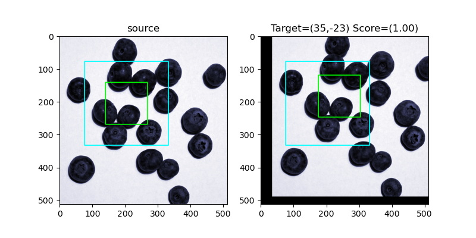

IMSIS
==================================================

Introduction
------------

IMSIS is an open source image analysis package in python.
The library contains functions to quickly create simple dialog based scripts, fast image processing sequences and perform basic image analysis.
The package relies on powerful libraries such as Numpy, Scipy, OpenCV and QT.

Typical applications would be:

- Dialog based scripts where syntax editing is replaced by runtime dialogs (input dialogs, warnings, property lists, radio button lists, text dialogs etc.)
- Dialog based feature selection (spots, lines, rectangles etc.)
- Fast multi image viewing with or without histograms
- Image batch processing (sharpening, denoising, morphological operations, color operations, image conversion etc.)
- Image analysis (finding unique features, line profiles, counting features, image alignment, image comparisons, image sharpness)
- Image filtering in Fourier space
- Fast image processing for machine learning data

Requirements
------------

IMSIS requires the following packages

- numpy 1.13.3
- scipy 1.1.0
- matplotlib 2.0.0
- opencv_python 4.0.0.21
- Pillow 6.2.0
- PyQt5 5.15

Requirements documentation
--------------------------

IMSIS Documentation building requires the following additional packages

- sphinx
- sphinx_rtd_theme
- rinohtype

Documentation can be automatically generated with python build_docs.py

Installation
------------

python setup.py sdist bdist_wheel

pip install dist\imsis-1.0-py3-none-any.whl

Example
-------

A simple example of loading and displaying an image

```
import imsis as ims

fn = r".\images\bberry.jpg"
im_blueberry = ims.Image.load(fn)

ims.View.plot(im_blueberry,title="Blueberry",window_title="Plot")
```

A list of examples of every method implemented can be found in the examples folder.

Some more can be found below:


Animated transitions
--------------------


Image blending
--------------


Image denoising
---------------


Interactive user dialogs
------------------------


Measurements on images
----------------------


Feature descriptor Matching
---------------------------


Find Brightest Spot
-------------------


Find Edges
----------


Find Feature
------------


Frequency domain image filtering
--------------------------------


Histogram operations
--------------------


HSV color channel editing
-------------------------


K-means clustering
------------------


Image masking
-------------

